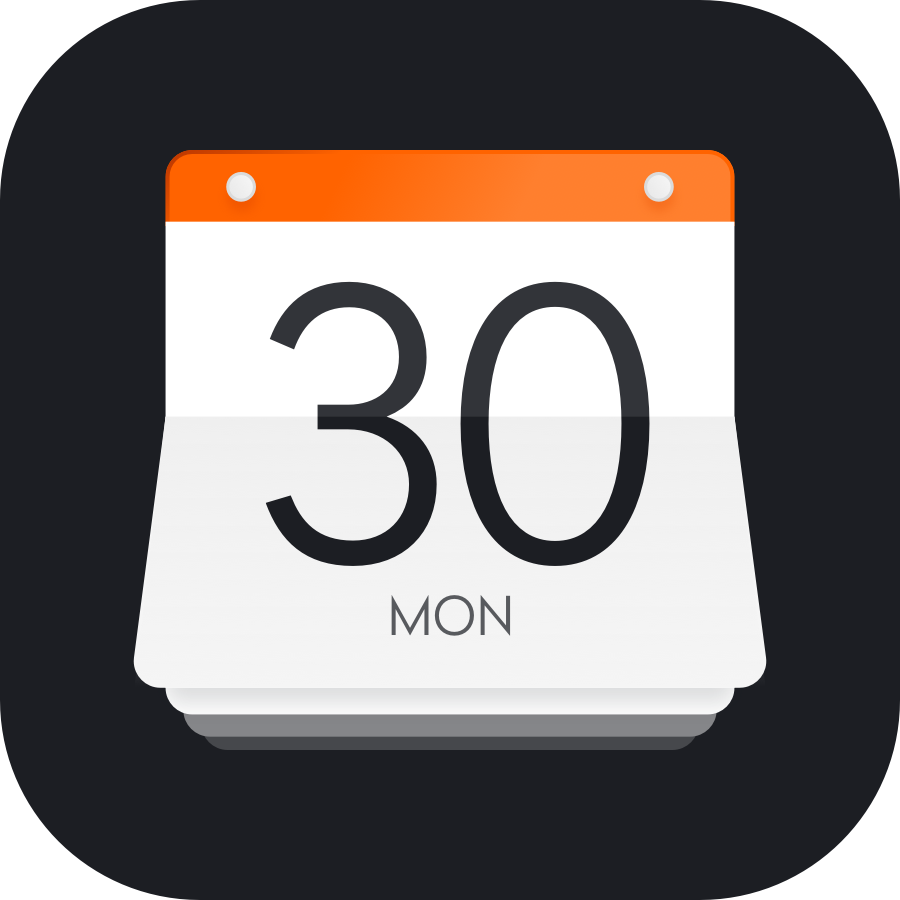
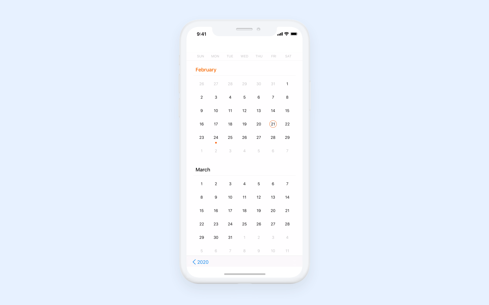
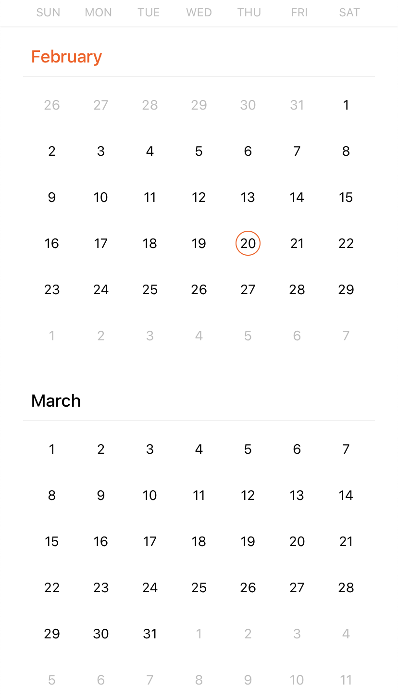
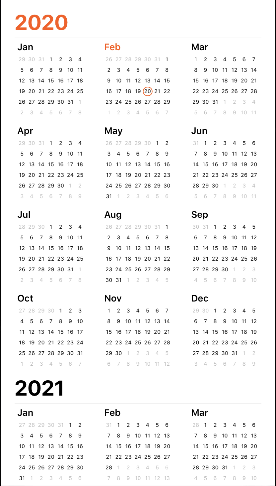
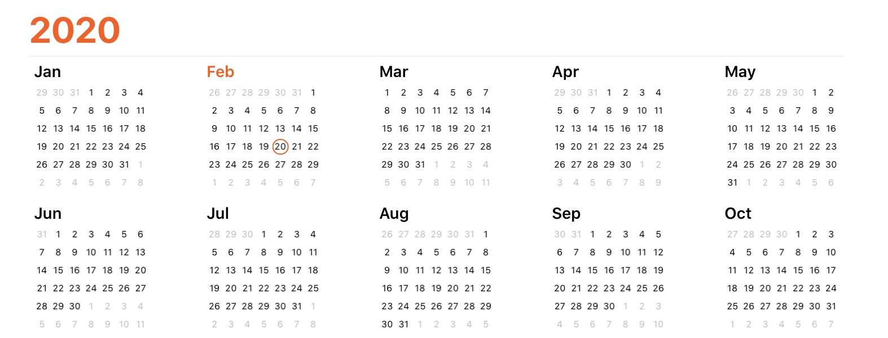
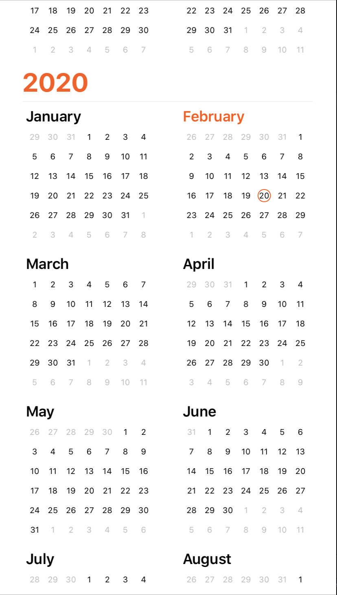
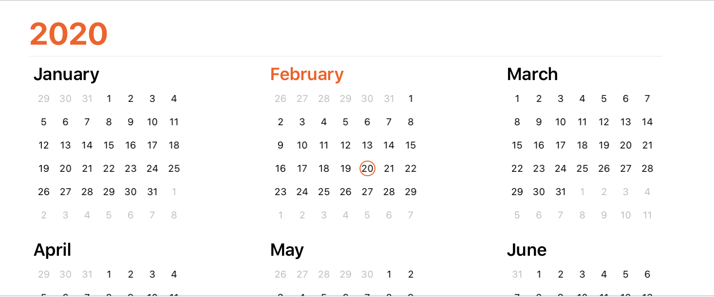
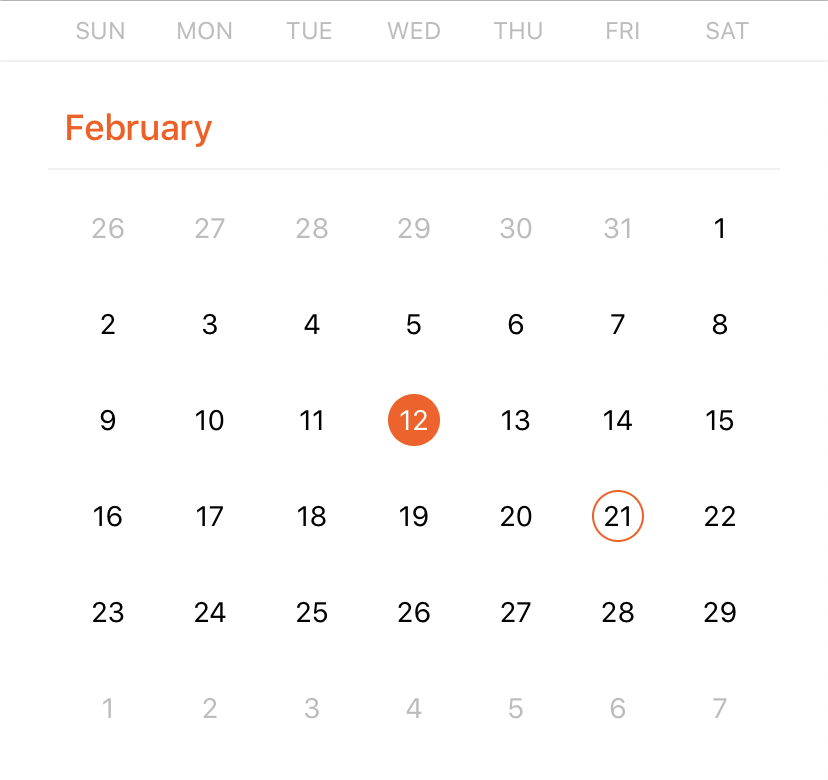
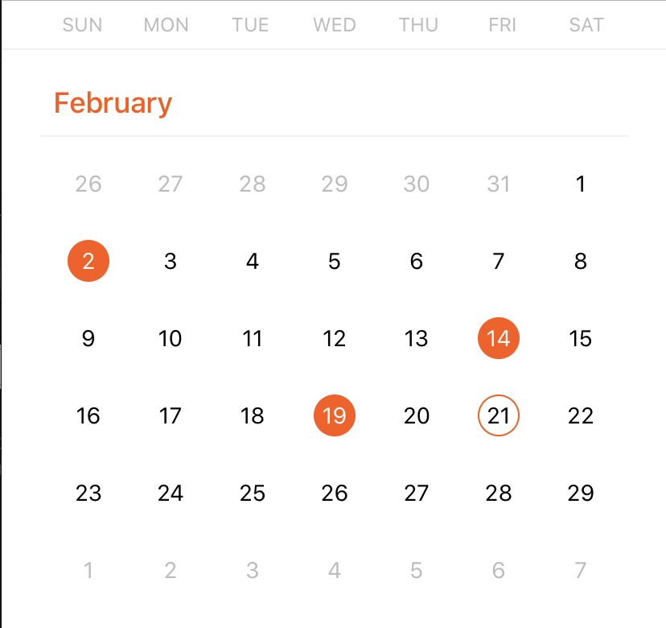
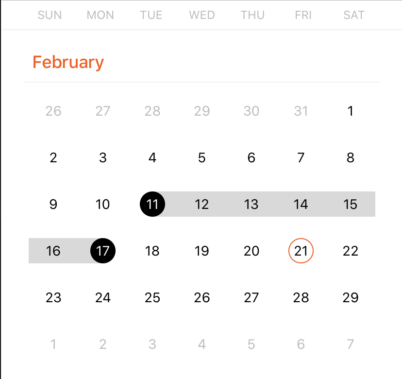

<p align="center"> </p>

## About 

YACalendar is a highly customizable iOS calendar that’s easy to integrate into your application. Currently, it supports year and month views with vertical and horizontal scrolling. Our solution optimized for all iPhone screens, so it will display correctly on old devices like the iPhone 5 as well as on the newest iPhone models.
YACalendar is constantly evolving and aims to become a one-size-fits-all solution. We’re planning to add event management functionality and the ability to attach notes, links, and documents to events. 

<p align="center"> </p>

## Features
|         | YACalendar  |
----------|-----------------
✅ | Year view with 2 or 3 columns and month view
✅ | Portrait and landscape modes 
✅ | Vertical and horizontal scrolling
✅ | Paging 
✅ | Markers for current and selected dates
✅ | Markers for past and future events
✅ | Ability to set the start of the week to Monday or Sunday
✅ | Weekend view
✅ | Selection of one, multiple, or a range of days 

## Project example

Take a look at an example project [here](YACalendar/YACalendarExample)

## Requirements

* Swift 5.0
* Xcode 11.2
* iOS 10.0+

## Installation

To install YACalendar via [CocoaPods](http://cocoapods.org), add the following lines to your Podfile:

```ruby
use_frameworks!

pod 'YACalendar'

```

Then make sure to add this line to your code:
```import YACalendar``` 

## Using YACalendar

1. Create a calendar view instance and add it to the view hierarchy.

```swift
let calendarView = CalendarView(frame: frame)
view.addSubview(calendarView)

```
***NOTE:*** You can use an interface builder for creating a calendar view. [Here’s](YACalendar/YACalendarExample) an example.

2. Create a calendar. If you want to change the first day of the week, change the ```firstWeekday``` property.

```swift
let calendar = Calendar.current
calendar.firstWeekday = 2 // 1 - Sunday, 2 - Monday

```

3. Specify the calendar grid type and scroll direction.

```swift
calendarView.grid.calendarType = .oneOnOne
calendarView.grid.scrollDirection = .vertical

```

4. Create the calendar data object, which contains the calendar itself, the start date, and the end date. Set it to the ```data``` property of the calendar view. All days will be displayed according to the specified calendar and within the range of the start and end dates.

```swift
calendarView.data = CalendarData(calendar: calendar, startDate: startDate, endDate: endDate)

```
***NOTE:*** After setting the ```data``` property, the calendar will be redrawn.

## Examples

### Month view
Month view with vertical and horizontal scrolling:
<p>

</p>

```swift
let calendarView = CalendarView(frame: frame)
calendarView.grid.calendarType = .onOnOne
calendarView.data = CalendarData()

```

### Year view 3×4 grid
Year view with a 3×4 grid for portrait orientation and a 5×2 grid for landscape orientation:
<p>
 
</p>

```swift
var calendarView = CalendarView(frame: frame)
calendarView.grid.calendarType = .threeOnFour
calendarView.data = CalendarData()

```
    
### Year view 2×3 grid
Year view with a 2×3 grid for portrait orientation and a 3×1 grid for landscape orientation:
<p>
 
</p>

```swift
let calendarView = CalendarView(frame: frame)
calendarView.grid.calendarType = .twoOnThree
calendarView.data = CalendarData()

```

## Customization

These settings can be configured directly on the ```CalendarView```.

#### Calendar properties
| Property                                                | Description                                                                                                                                                                                                                                                                                            |
|---------------------------------------------------------|--------------------------------------------------------------------------------------------------------------------------------------------------------------------------------------------------------------------------------------------------------------------------------------------------------|
| **currentDate**: Bool                                  | The date to which the calendar should scroll  |
| **selectionType**: SelectionType                       | Selection type (for selecting dates): one, many, range<p></p>| 

#### Calendar Methods
| Method                                                | Description                                                                                                                                                                                                                                                                                            |
|---------------------------------------------------------|--------------------------------------------------------------------------------------------------------------------------------------------------------------------------------------------------------------------------------------------------------------------------------------------------------|
| **func scroll(to date: Date)**                          | Scroll to the month with the specified date.  |
| **func selectDay(with date: Date)**                          | Select/deselect a specific day. Use this method for selecting/deselecting a single day.  |
| **func selectDays(with dates: [Date])**                      | Select/deselect specified days. Use this method for selecting/deselecting multiple days.  |
| **func selectRange(with startDay: Date, endDate: Date)**     | Select a range of days within the start and end dates. |
| **func setEvents(_ events: [CalendarEvent])**                | Set events to the dates specified in the event. |
| **func disableDays(with dates: [Date])**                     | Disable specified days. |

#### Changing the look of the day, month, month header, day symbols, and year header
If you want to change the font, color, or other UI properties of one of these elements, you must override the corresponding element config.

For example, to change the text color for days:

1. Inherit ```DayConfig``` and override the method.

```swift
class MyDayConfig: DayConfig {
    
    override func textColor(for state: DayState, indicator: DayIndicator) -> UIColor {
        return .black
    }
}
```

2. Set config to the calendar.
```swift 
calendarView.config.day = MyDayConfig()

```

#### Grid Properties

You can set these settings by calling ```calendar.grid```

| Property                                                | Description                                                                                                                                                                                                                                                                                            |
|---------------------------------------------------------|--------------------------------------------------------------------------------------------------------------------------------------------------------------------------------------------------------------------------------------------------------------------------------------------------------|
| **calendarType**: CalendarType                         | Grid representation of months. Possible values: oneOnOne, twoOnThree, threeOnFour|
| **scrollDirection**: ScrollDirection                   | Set vertical or horizontal scrolling direction | 

## Project plans
We have far-reaching plans to improve YACalendar. We want to add:
- Event view (creating, management, recurring events)
- Appointment scheduling view
- Dark mode


## Release Notes

Version 1.0
* Release version.

## License

`YACalendar` is released under an MIT License. See `LICENSE` for details.
